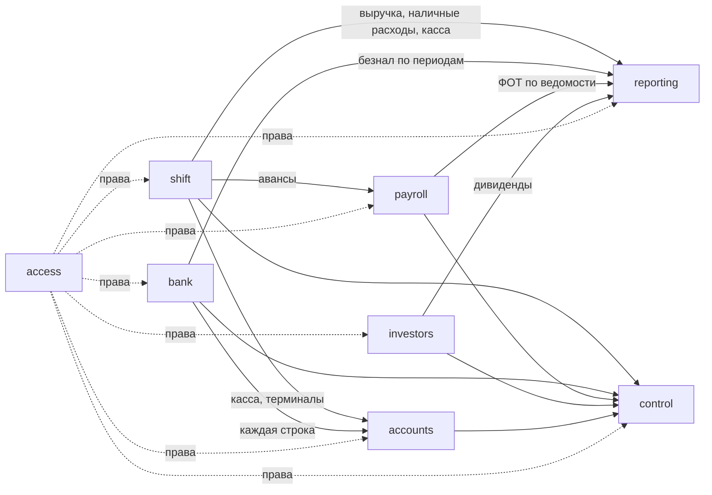

# Домены

Подтверждены владельцем 2026-09-04. Код правила: `BR-<DOM>-NNN`, где DOM — трёхбуквенный код из таблицы.

| Домен | DOM | Что внутри | Код / таблицы |
|---|---|---|---|
| shift — Смены и касса | SHF | отчёт дня, отделы и типы оплат, изъятия, пересчёт кассы, терминалы, операционный день, PDF/WhatsApp, справочник поставщиков | `DailyReportPage`, `dates.js`, `StatementUploadCard`, `daily_reports`, `suppliers` |
| bank — Выписки и категоризация | BNK | разбор Kaspi/Halyk, правила категоризации, дедупликация, периоды начисления, план счетов | `bankImport.js`, `categorize.js`, `halykStatement.js`, `pdfText.js`, `categories.js`, `BankImportPage`, `bank_transactions`, `bank_rules`, `categories` |
| accounts — Счета и остатки | ACC | касса/банки/депозиты/терминалы, переводы, сверка остатков | `AccountsPage`, `accounts`, `account_transactions`, `account_balances` |
| reporting — P&L, Cash Flow, аналитика | RPT | структура P&L, источники и приоритеты, знаки, историческая замена, CF прямым методом, дашборд, аналитика | `pnlCompute.js`, `pnl.js`, `PnLPage`, `CashFlowPage`, `DashboardPage`, `AnalyticsPage`, `pnl_data` |
| control — Контроль (замкнутый контур) | CTL | сверки выручки, кассы, эквайринга, ФОТ, наличных у учредителей, остатков; пороги; дни закрытия | `reconcile.js`, `ControlPage`, `settings.closures / owner_cash_opening` |
| payroll — Зарплаты и персонал | PAY | ведомости 1–15 / 16–конец, ставки и проценты по должностям, авансы, техперсонал, методика ФОТ | `PayrollPage`, `StaffPage`, `positions`, `staff`, `payroll_periods`, `payroll_details` |
| investors — Учредители | INV | доли, дивиденды (банк и наличные), взносы, продажа долей, ROI | `InvestmentsPage`, `components/investments/*`, `investors`, `investor_transactions` |
| access — Доступ и настройки | ACS | пользователи, роли, права, вход, системные настройки, уведомления Telegram | `store.js`, `Layout.jsx`, `UsersPage`, `RolesPage`, `SettingsPage`, `LoginPage`, `app_users`, `roles`, `permissions`, `settings` |

## Связи

## Границы
- Наличные у учредителей: транзит, остаток на 1 января и допуск — control; дивиденды, доли и «Фин помощь» — investors; категории строк — bank.
- Поставщики — справочник внутри shift.
- Технические слои (интеграции, парсеры, инфраструктура) — `docs/20-architecture/`, не домены.
- SaaS / несколько заведений — не описано; открытый вопрос владельцу (TASK-012).
