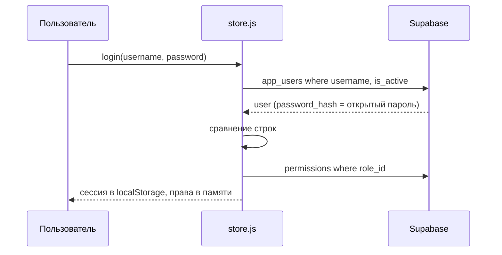

# Доступ и настройки

## Цель
Каждый пользователь видит и делает только то, что разрешено его роли; настройки системы хранятся в одном месте.

## Роли
- Админ — создаёт пользователей, правит матрицу прав, настройки.
- Все — входят по логину и паролю.

## Основной сценарий
1. Пользователь → логин и пароль → система ищет активного пользователя, сравнивает пароль (BR-ACS-001), сохраняет сессию.
2. Система → грузит профиль с ролью и права роли (BR-ACS-002, BR-ACS-003).
3. Меню и действия показываются по `hasPermission` (BR-ACS-004).
4. Админ → «Пользователи»: создать/деактивировать, назначить роль; «Роли»: матрица прав; «Настройки»: Telegram, час отсечки.

## Схема

## Исключения
| Ситуация | Что происходит | BR |
|---|---|---|
| Роль «Админ» переименована | полные права теряются (проверка по имени) | BR-ACS-002 |
| Прямой URL страницы без права | страница открывается, если не проверяет право сама | BR-ACS-004 |
| Нет `role_id` | роль по умолчанию «Менеджер» | BR-ACS-002 |
