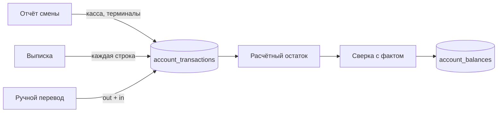

# Счета и остатки

## Цель
Знать расчётный остаток каждого счёта и подтверждать его фактом из банка или пересчёта кассы.

## Роли
- Система — создаёт движения из отчётов смен (касса, терминалы) и выписок (каждая строка).
- Учредитель / пользователь с `accounts.manage` — переводы между счетами и ручные операции.
- Пользователь с `settings.edit` — создаёт и редактирует счета.

## Триггер
Отправка отчёта смены, сохранение выписки, ручной перевод, сверка на дату.

## Основной сценарий
1. Система → при отправке отчёта корректирует «Кассу» и создаёт доход по терминалам (BR-SHF-010).
2. Система → при сохранении выписки создаёт движение по строке (BR-BNK-013).
3. Пользователь → перевод между счетами: две связанные операции (BR-ACC-004).
4. Пользователь → «Сверка»: система считает ожидаемый остаток на дату (BR-ACC-002, BR-ACC-003), пользователь вводит факт → запись в `account_balances` с расхождением (BR-ACC-005).
5. «Контроль» сравнивает расчётный остаток с последней сверкой месяца (BR-ACC-006).

## Схема

## Исключения
| Ситуация | Что происходит | BR |
|---|---|---|
| Счёт удаляется | удаляются его сверки, движения и парные стороны переводов на других счетах | BR-ACC-004 |
| Счёт типа «касса» | остаток = конец последней закрытой смены, а не сумма движений | BR-ACC-003 |
| Депозит | выписки не загружаются, остаток не ведётся | BR-ACC-007 |

## Связанные процессы
- shift/process.md, bank/process.md — источники движений; control/process.md — сверка.
