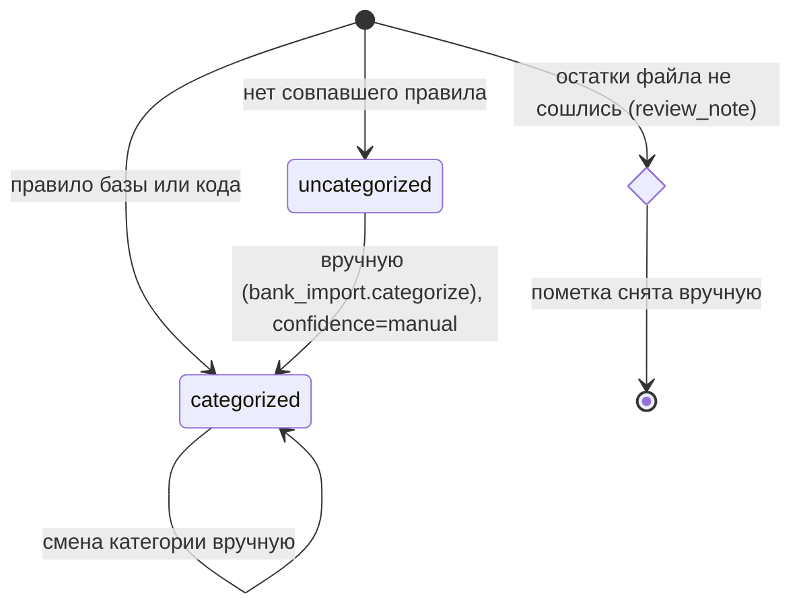

# Сущности

## Строка выписки (`bank_transactions`)
**Назначение.** Одна операция по банковскому счёту.
**Ключевые поля**: `transaction_date` (операционная, TEXT), `amount` (> 0), `is_debit`, `beneficiary`, `purpose`, `knp`, `category`, `confidence` (auto/high/medium/low/manual), `period_from/to`, `account_id`, `tx_hash` (уникален), `import_file`, `import_batch_id`, `review_note`.

**Состояния**

**Инварианты**
- `tx_hash` уникален (BR-BNK-004); строка всегда имеет парное движение по счёту (BR-BNK-013).
- `period_from ≤ period_to`, по умолчанию месяц операции (BR-BNK-012).

## Правило категоризации (`bank_rules` + `bank_rule_conditions`)
Поля: `name`, `logic` (and/or), `category_code`, `action` (categorize/hide), `is_active`; условия: `field` (beneficiary/purpose/knp/amount/is_debit), `operator`, `value`, `sort_order`. Порядок применения — по `created_at` (BR-BNK-006).

## Категория (`categories`)
Поля: `code` (уникален), `name`, `type` (income/cogs/opex/below_ebitda/other), `pnl_group`, `sort_order`, `is_active`. Канон — миграция 008 (BR-BNK-015).
