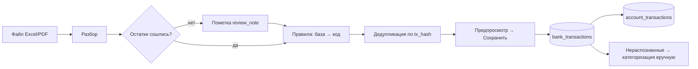

# Выписка банка

## Цель
Каждая безналичная операция попадает в базу один раз, с категорией и периодом начисления, и двигает баланс счёта.

## Роли
- Менеджер смены — загружает файл (в отчёте смены).
- Учредитель / бухгалтер — загружает на странице «Импорт выписки», ставит категории нераспознанным, снимает пометки «к проверке», правит правила.

## Триггер
Ежедневно в начале смены (вчерашний день) или по мере получения файла.

## Основной сценарий
1. Пользователь → выбирает счёт и файл → система определяет формат по расширению (BR-BNK-001) и разбирает строки (BR-BNK-002, BR-BNK-016).
2. Система → проверяет полноту: остатки и обороты (BR-BNK-005).
3. Система → каждой строке ставит категорию: правила базы → правила кода → «не распознано» (BR-BNK-006…011), период начисления = месяц операции (BR-BNK-012).
4. Система → отбрасывает строки с известным `tx_hash` (BR-BNK-004) и показывает предпросмотр: новых, дублей, скрытых, без категории, сошлись ли остатки.
5. Пользователь → «Сохранить» → строки в `bank_transactions`, по каждой — движение по счёту (BR-BNK-013); в Telegram уходит сводка.
6. Учредитель / бухгалтер → на странице «Импорт выписки» ставит категории нераспознанным, при необходимости меняет период, снимает пометку «к проверке» (BR-BNK-005).
7. P&L и Cash Flow подхватывают строки по категории и периоду (домен reporting); «Контроль» сверяет зачисления с терминалами (домен control).

## Схема

## Исключения
| Ситуация | Что происходит | BR |
|---|---|---|
| Все строки уже есть | ничего не сохраняется, сообщение «уже загружены» | BR-BNK-004 |
| Остатки не сошлись | сохраняется с пометкой; блокер контура до снятия | BR-BNK-005, BR-CTL-007 |
| Правило «скрыть» | строка не импортируется | BR-BNK-018 |
| PDF не Halyk / Excel не Kaspi | ошибка «не найдено ни одной операции» | BR-BNK-001 |
| Операция банка «в обработке» изменилась | возможен дубль — open-questions #1 | — |

## Связанные процессы
- shift/process.md — загрузка из отчёта смены.
- accounts/process.md — движения и остатки.
- reporting — распределение по периодам.
