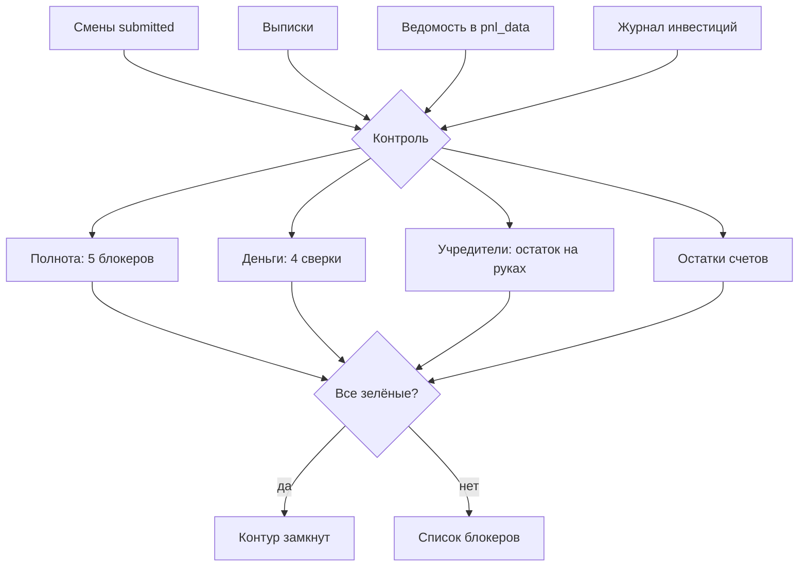

# Контроль

## Цель
Каждое звено движения денег подтверждается двумя независимыми источниками; расхождение видно на следующий день, а не через месяц.

## Роли
- Учредитель / бухгалтер — смотрит «Контроль», закрывает блокеры (категории, пометки, ведомость, сверки остатков).
- Менеджер — закрывает смены и грузит выписки (входные данные).

## Триггер
Ежедневно; окончательно — при закрытии месяца.

## Основной сценарий
1. Система → полнота данных: смены сданы (BR-CTL-004), черновиков нет, выписка свежая (BR-CTL-005), нераспознанных нет (BR-CTL-006), строк «к проверке» нет (BR-CTL-007).
2. Система → сверки денег: выручка отделы ↔ оплаты (BR-CTL-001), касса (BR-CTL-002), эквайринг по банкам (BR-CTL-003), ФОТ-петля (BR-CTL-008, BR-CTL-009).
3. Система → наличные у учредителей с начала года (BR-CTL-010…013).
4. Система → остатки счетов ↔ последняя сверка месяца (BR-CTL-014).
5. Все 11 блокеров зелёные → «контур замкнут» (BR-CTL-016).

## Схема

## Исключения
| Ситуация | Что происходит | BR |
|---|---|---|
| День закрытия | не считается пропущенной сменой | BR-CTL-004 |
| Нет ведомости за месяц | ФОТ-петля «нет данных», подсказка внести ФОТ | BR-CTL-008 |
| Нет терминала банка в отчёте | эквайринг сверяется по типу оплаты | BR-CTL-003 |
| Остаток у учредителей отрицательный сверх допуска | красный: модель что-то объясняет дважды | BR-CTL-011 |

## Связанные процессы
- shift, bank, payroll, investors, accounts — источники; reporting — закрытие месяца.
