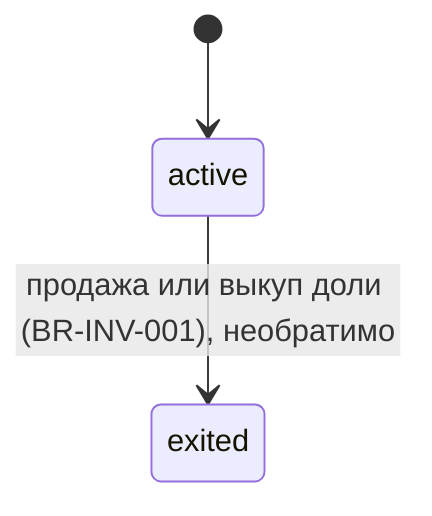

# Сущности

## Учредитель (`investors`)
`full_name`, `share_pct` (по умолчанию 33.33), `entry_date`, `exit_date`, `exit_type` (sold/buyout), `purchase_price`, `successor_id`, `status`.

## Операция учредителя (`investor_transactions`)
`investor_id`, `transaction_date`, `type` (investment/dividend/share_purchase/share_sale), `amount`, `notes`, `created_by`. Состояний нет. Инвариант: дивиденды одной выплаты равны у всех активных учредителей (BR-INV-004).
