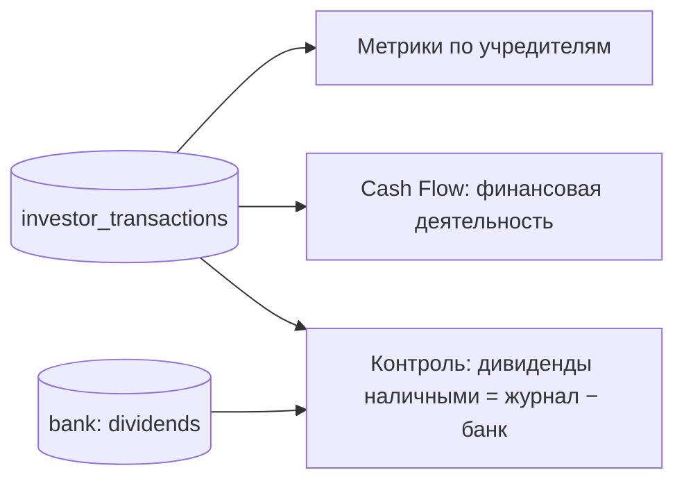

# Учредители и дивиденды

## Цель
Знать, сколько каждый учредитель вложил и получил, и чтобы каждая выплата подтверждалась банком или наличными из контура.

## Роли
- Учредитель (Жайык) — вносит операции в журнал.
- Система — считает метрики по инвесторам, Cash Flow и «Контроль» подтягивают дивиденды.

## Триггер
Выплата дивидендов (обычно 500 000 каждому за раз), взнос, сделка с долей.

## Основной сценарий
1. Учредитель → добавляет операцию: тип, дата, сумма, учредитель (BR-INV-002); дивиденды — всем троим поровну (BR-INV-004).
2. Система → метрики по учредителю: вложено, получено, прибыль, ROI, месяц окупаемости (BR-INV-003).
3. Cash Flow → дивиденды месяца из банка, если он есть, иначе из журнала (BR-RPT-011).
4. «Контроль» → дивиденды наличными = журнал − банк (BR-CTL-012) вычитаются из наличных у учредителей.

## Схема

## Исключения
| Ситуация | Что происходит | BR |
|---|---|---|
| Учредитель продал долю | operations share_sale / share_purchase, статус exited, successor | BR-INV-001 |
| «Фин помощь» от учредителя на счёт | это возврат снятых наличных, не взнос | BR-BNK-011 |
| Дивиденды выплачены наличными из снятых денег | в банке их нет, журнал — единственный источник | BR-CTL-012 |
