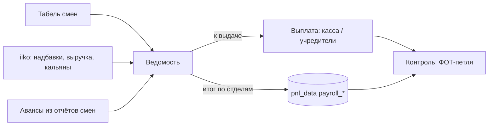

# Зарплаты

## Цель
Посчитать начисления по сотрудникам за половину месяца, учесть авансы, выдать остаток и записать ФОТ месяца в P&L.

## Роли
- Управляющая — ведёт табель, готовит ведомость (сейчас в Excel), выдаёт остаток из кассы.
- Учредитель — вносит итог ФОТ по отделам в P&L, выдаёт из наличных, если кассы не хватает.
- Система (модуль «Зарплаты», текущая версия) — считает `дни × ставка + продажи × %`, подтягивает авансы.

## Триггер
16-е число (за 1–15) и 1-е число следующего месяца (за 16–конец).

## Основной сценарий (как сейчас, по ведомостям)
1. Управляющая → отмечает смены по дням (табель), берёт три отчёта iiko (надбавка официантов, выручка по дням и складам, продажи кальянов).
2. Управляющая → по каждому сотруднику: начислено = смены × оклад + % по правилу должности (BR-PAY-006…011); авансы — из отчётов смен (BR-PAY-004); к выдаче = начислено − авансы − удержания (BR-PAY-002).
3. Выплата наличными: из кассы (изъятие с комментарием «зп», BR-CTL-009) или из наличных учредителей.
4. Учредитель → итог по отделам за обе половины → ручные строки `pnl_data` (BR-RPT-009).
5. «Контроль» → ФОТ-петля (BR-CTL-008).

## Схема

## Исключения
| Ситуация | Что происходит | BR |
|---|---|---|
| Сотрудник в двух ролях | две строки ведомости | BR-PAY-013 |
| Отпуск без содержания | строка с нулём | BR-PAY-013 |
| Штраф | вычитается вручную из % или «к выдаче»; отдельной колонки нет | BR-PAY-013 |
| Сотрудник уволен | строки сохраняются в группе «Уволенные» | BR-PAY-014 |

## Связанные процессы
- shift — авансы; control — ФОТ-петля; reporting — ФОТ в P&L.
Исходник: `docs/ФОТ-методика.md` (перенесено 2026-09-04).
