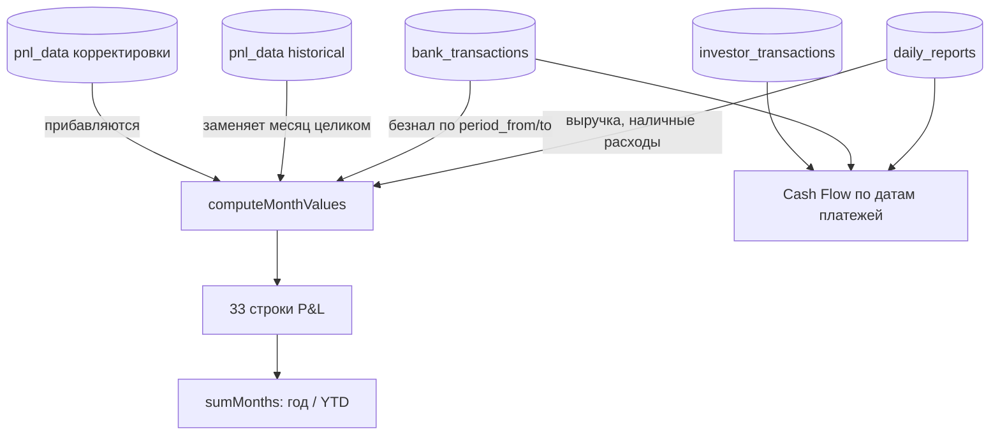

# P&L и Cash Flow

## Цель
Показать прибыль по периодам начисления (P&L) и движение денег по факту (Cash Flow) из одних и тех же источников без двойного счёта.

## Роли
- Учредитель — смотрит, вносит ручные корректировки (ФОТ по ведомости, расходы вне банка и кассы).
- Система — считает (`pnlCompute.js`, `CashFlowPage.jsx`).

## Триггер
Открытие страницы за месяц / год; закрытие месяца — когда загружены все выписки и ведомость.

## Основной сценарий
1. Система → определяет режим месяца: исторический (только `pnl_data` historical) или живой (BR-RPT-002).
2. Живой месяц: выручка и наличные расходы из отправленных смен (BR-RPT-003, BR-RPT-006), безнал из банка по периоду начисления (BR-RPT-004, BR-RPT-007), сверху ручные корректировки (BR-RPT-001).
3. Система → сворачивает группы: подстатьи → группа → OpEx → расходы → прибыль (BR-RPT-008).
4. Учредитель → вносит ФОТ месяца по ведомости (BR-RPT-009) и расходы вне контура (BR-RPT-016).
5. Cash Flow считает тот же месяц по датам платежей (BR-RPT-011).
6. Год: месяцы суммируются, проценты пересчитываются от итогов (BR-RPT-008).

## Схема

## Исключения
| Ситуация | Что происходит | BR |
|---|---|---|
| За месяц нет строк банка | P&L показывает предупреждение «выписки не загружены», расходы выглядят заниженными | BR-RPT-015 |
| Есть historical и есть смены | historical игнорируется, считается живой месяц | BR-RPT-002 |
| Корректировка без категории | идёт напрямую в прибыль (legacyNet) | BR-RPT-001 |
| Расход оплачен через другое юрлицо | ручная строка pnl_data в месяц события | BR-RPT-016 |

## Связанные процессы
- bank — периоды начисления; payroll — ФОТ по ведомости; control — блокеры закрытия месяца.
