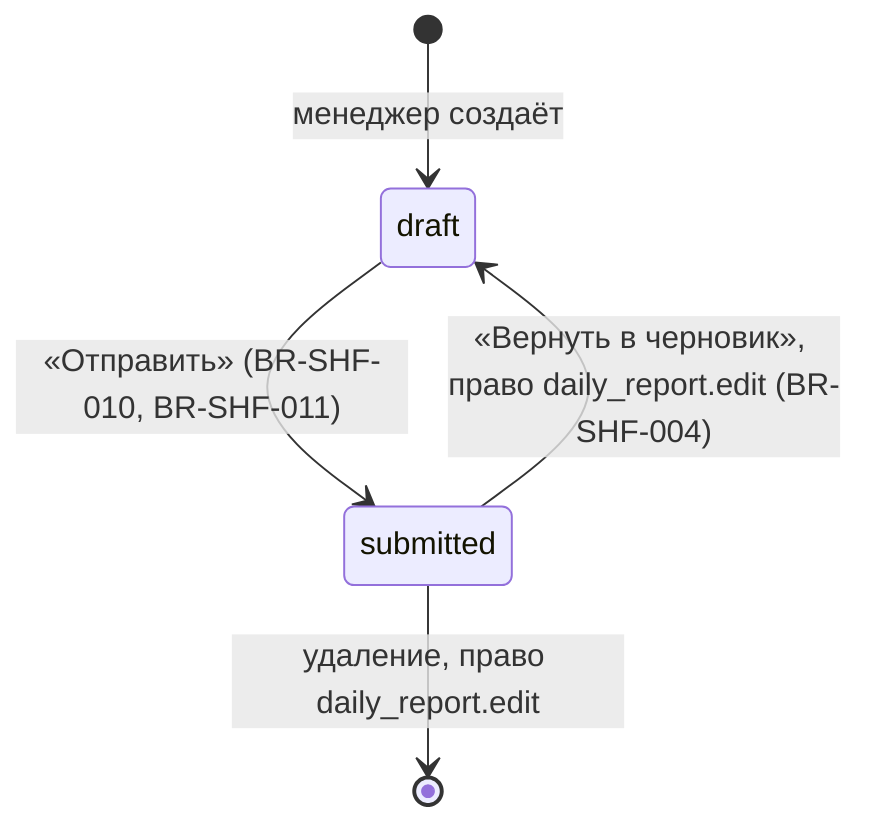

# Сущности

## Отчёт смены (`daily_reports`)
**Назначение.** Один операционный день: выручка, изъятия из кассы, остатки, терминалы.

**Ключевые поля**: `report_date` (уникальна), `status`, `manager_name`, `submitted_at`; в JSONB `data`: `departments[] {name, amount}`, `revenue[] {type, amount, checks}`, `terminals {accountId: amount}`, `withdrawals {suppliers_kitchen[], suppliers_bar[], tobacco[], payroll[], other[], cash_withdrawals[]}` (строки `{name, amount, comment}`), `cash_start`, `cash_end`, `discrepancy`. Дублирующие колонки для списков: `total_revenue`, `total_withdrawals`, `cash_discrepancy`.

**Состояния**

**Инварианты**
- Одна дата — один отчёт (BR-SHF-003).
- `discrepancy = cash_end − (cash_start + наличные − изъятия)` (BR-SHF-006).
- Сумма отделов = сумма оплат с допуском 1 ₸ (BR-SHF-018) — не enforced в форме.

## Поставщик (`suppliers`)
**Назначение.** Автоподсказки имён в секциях закупа. Поля: `name`, `category` (Кухня/Бар/Кальян/Хозтовары/Прочее), `is_active`. Состояний нет.
