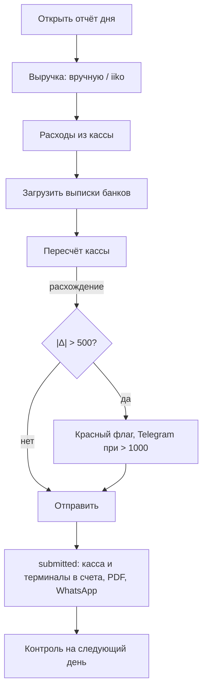

# Смена и отчёт дня

## Цель
Зафиксировать один операционный день: сколько заработали, сколько и кому выдали из кассы, сколько денег осталось, и дать сверке две независимые стороны (BR-SHF-006, BR-CTL-001).

## Роли
- Менеджер смены — заполняет и отправляет отчёт, загружает выписки банков (с сентября 2026).
- Учредитель / пользователь с `daily_report.edit` — возвращает отчёт в черновик, удаляет.
- Система — считает кассу, шлёт Telegram, генерирует PDF и текст для WhatsApp.

## Триггер
Закрытие заведения (обычно после полуночи; операции до 06:00 относятся к предыдущему дню — BR-SHF-001).

## Основной сценарий
1. Менеджер → открывает «Отчёт дня» → дата по умолчанию = текущий операционный день (BR-SHF-002); касса на начало подставляется из прошлой закрытой смены (BR-SHF-005).
2. Менеджер → блок «Доходы»: выручка по отделам (Кухня, Бар, Кальян, Прочее) и по типам оплат (Наличные, Kaspi, Halyk, Wolt, Glovo, Yandex Eda, Прочее) вручную или кнопкой «Заполнить из iiko» (BR-SHF-016); суммы по терминалам — вручную.
3. Менеджер → блок «Расходы»: закуп кухни/бара/кальяна, авансы персоналу, прочие расходы, изъятия из кассы с комментарием (BR-SHF-008).
4. Менеджер → карточка «Выписки банков»: загружает файл за вчера и сегодня (BR-SHF-014).
5. Менеджер → блок «Касса»: остаток на конец; система показывает ожидаемый остаток и расхождение (BR-SHF-006, BR-SHF-007).
6. Менеджер → «Отправить отчёт» → статус submitted (BR-SHF-004); система корректирует счёт «Касса» и пересоздаёт операции по терминалам (BR-SHF-010), шлёт Telegram, скачивает PDF, открывает WhatsApp (BR-SHF-011).
7. На следующий день «Контроль» сверяет отчёт с банком и iiko (домен control).

## Схема

## Исключения
| Ситуация | Что происходит | BR |
|---|---|---|
| На дату уже есть отправленный отчёт | сохранение блокируется | BR-SHF-003 |
| Заведение закрыто (ремонт) | отчёт не требуется, день в `settings.closures` | BR-SHF-013 |
| Выписке больше 3 дней | при отправке — предупреждение, не блок | BR-SHF-015 |
| iiko недоступен | поля вводятся вручную | BR-SHF-016 |
| Нужно исправить отправленный отчёт | «Вернуть в черновик» (право `daily_report.edit`), движения по счетам за дату удаляются | BR-SHF-004 |

## Связанные процессы
- bank/process.md — что происходит с загруженной выпиской.
- control/process.md — ежедневная сверка.
- payroll/process.md — авансы из отчётов попадают в ведомость.
