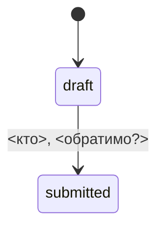

# Сущности

## <Сущность> (`<таблица>`)
**Назначение.** <Зачем существует.>

**Ключевые поля** (только бизнес-значимые):
- `<поле>` — <смысл>

**Состояния и переходы**

**Инварианты**
- <утверждение, которое всегда верно> (BR-<DOM>-NNN)
