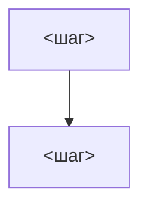

# <Название процесса>

## Цель
<Что получает бизнес по итогу процесса.>

## Роли
- <Роль> — <что делает в процессе>

## Триггер
<Событие или расписание, с которого процесс начинается.>

## Основной сценарий
1. <Кто> → <что делает> → <с какими данными> → <результат> (BR-<DOM>-NNN)
2. …

## Схема

## Исключения
| Ситуация | Что происходит | BR |
|---|---|---|
| <…> | <…> | BR-<DOM>-NNN |

## Связанные процессы
- <домен>/process.md — <как связан>
